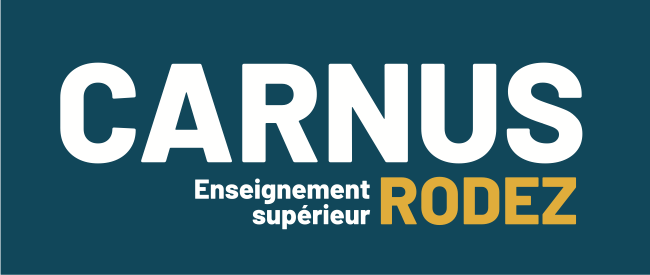

#  <cite>

#  <cite>
Service GTB pour bâtiments communaux
</cite>

---
### Table des matières :

* <a href="#CONT"> Contexte du projet</a>
* <a href="#OBJ">Objectifs du Projet</a>
* <a href="#LOGI"> Logiciels utilisés</a>
* <a href="#TAC">Les différentes tâches personnelles</a>
* <a href="#PRB"> Problèmes rencontrés</a>
* <a href="#ARC"> Architecture du projet</a>
* <a href="#SUI"> Suivi des tâches effectuées</a>
---

## <cite> Contexte du projet</cite>

Le SMICA a pour objet la recherche, la veille technologique, l’accompagnement, le développement, la formation et la gestion de services et usages dans le domaine numérique pour l’ensemble de ses adhérents. Il intervient dans de nombreux domaines : gestion administrative (état civil, élections, paie, comptabilité, facturation), maintenance du matériel informatique, hébergement des données, dématérialisation des échanges avec les services de l’Etat, profil acheteur, réalisation de sites internet, systèmes d’information géographique, …

Les mairies sont en charge de bâtiments communaux qui représentent un coût de fonctionnement et des responsabilités en termes de gestion d’accès de qualité d’air et autres. Celles-ci trouveraient un grand intérêt à profiter d’un système de GTB leur permettant de suivre et commander l’ensemble de leurs bâtiments.

C’est pour cela que le SMICA désire proposer un nouveau service de Gestion Technique du Bâtiment à leurs adhérents pour un coût acceptable.

---

## <cite> Objectifs du projet</cite>

Le principal objectif de ce projet est de permettre au SMICA de proposer à ses clients une solution de gestion d’informations fiable et peu coûteuse

Ce projet permettra dans un second temps aux élèves en charge de ce dernier de se “professionnaliser” en s’impliquant dans les tâches attribuées. Il permettra une évaluation de leurs compétences dans le milieu professionnel en vue de l'examen du BTS. 

---

## <cite> Logiciels utilisés</cite>

      

---

## <cite> Les différentes tâches personnelles du projet</cite>

|Tâche| Détail de la tâche|
| :-------------- |:----------------------------------------|
| Rédaction des différents documents | :small_blue_diamond:Rédaction du cahier des charges, du markdown, des différents diagrammes nécessaires pour un bon suivi du projet   :small_blue_diamond: Rédaction d'un journal de bord séance par séance. |
| Conception de l’interface utilisateur | :small_blue_diamond: Créer une maquette pour les différentes interfaces.  :small_blue_diamond:Définir une structure pour les différentes pages.|
| Développement des interfaces | :small_blue_diamond: Développer une interface “Administrateur” avec des éléments visibles uniquement par ce dernier:   :arrow_right: Créer une interface pour pouvoir ajouter et configurer des bâtiments   :arrow_right: Afficher la liste de tous les bâtiments et capteurs   :small_blue_diamond: Développer une interface “Responsable de site”:   :arrow_right: Cette interface devra afficher les températures actuelles   :arrow_right: Elle devra également intégrer une partie pour gérer le chauffage   :small_blue_diamond:Développer une interface “Utilisateur”   :arrow_right: Cette page devra seulement afficher les températures    |
| Style et responsivité | :small_blue_diamond: Mettre les pages en forme grâce au CSS, cela permettra d’adapter également les pages pour les afficher sur n’importe quel support. |
| Intégration avec le backend | :small_blue_diamond: Utiliser JavaScript afin de récupérer les données via une API  :small_blue_diamond:Gérer via une interface l’affichage dynamique des données.|
| 1ère phase de tests et validation | :small_blue_diamond: Tester l'interface sur différents navigateurs pour voir si les pages sont adaptées à tous les navigateurs   :small_blue_diamond: Corriger les bugs et améliorer l'expèrience utilisateur |
| 2nde phase de tests et validation | :small_blue_diamond: Effectuer des tests de connectivité: Vérifier que tous les composants puissent communiquer comme prévu initialement.   :small_blue_diamond: Valider la configuration des services: Tester chaque service afin de s'assurer que tout fonctionne correctement |
| Documentation | :small_blue_diamond: Documenter et rédiger une notice d'utilisation |

---

## <cite> Problèmes rencontrés</cite>

---

## <cite> Architecture du projet</cite>

📦Projet GTB
┗ 📂Dashboard
┃ ┣ 📜index.php
┃ ┣ 📜login.php
┃ ┣ 📜logout.php
┃ ┣ 📜style.css

---

## <cite>Suivi des tâches effectuées</cite>

| Tâche réalisée | Description de la tâche | Étât de la tâche | Dâte de réalisation de la tâche |  
|:----------|:-------------|:------:| :------: |
| Rédaction des différents documents |  :small_blue_diamond:Rédaction du cahier des charges, du markdown, des différents diagrammes nécessaires pour un bon suivi du projet   :small_blue_diamond: Rédaction d'un journal de bord séance par séance. | En cours | Tout au long du projet |
| Conception de l’interface utilisateur | :small_blue_diamond: Créer une maquette pour les différentes interfaces.  :small_blue_diamond:Définir une structure pour les différentes pages. | En cours | Début:11/02/2025   Fin:  |
| Développement des interfaces | :small_blue_diamond: Développer une interface Administrateur avec des éléments visibles uniquement par ce dernier   :small_blue_diamond:Développer une interface Responsable   :small_blue_diamond:Développer une interface Utilisateur| En cours | Début:12/02/2025   Fin:  |
| Style et Responsivité | :small_blue_diamond: Mettre les pages en forme grâce au CSS, cela permettra également d'adapter également les pages pour les afficher sur n'importe quel support | Pas commencée | Début:     Fin: |
| Intégration avec le backend | :small_blue_diamond: Utiliser JavaScript afin de récupérer les valeurs via une API   :small_blue_diamond:Gérer via une interface l'affichage dynamique des données | Pas commencée | Début:    Fin:|
| 1ère phase de tests et validation | :small_blue_diamond: Tester l'interface sur les différents navigateurs possibles   :small_blue_diamond: Corriger les bugs et améliorer l'expérience utilisateur | Pas commencée | Début:   Fin: |
| 2ème phase de tests et validation | :small_blue_diamond: Vérifier que tous les composants puissent communiquer entre eux comme prévu   :small_blue_diamond: Tester chaque service afin de s'assurer que tout fonctionne correctement | Pas commencée | Début:   Fin: |
--- 

[:arrow_up:](#top)